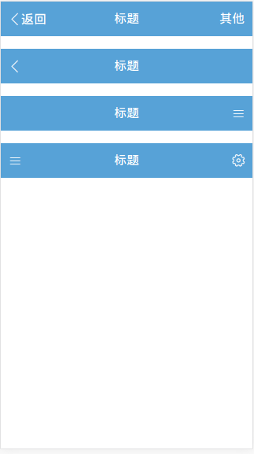

# Header
```Header```用于webapp的顶部导航。
# 代码示例
```
<!-- header 内容 -->
<header class="header">
  <h1 class="header-middle">标题</h1>
  <div class="header-right">
    <i class="icon-font">&#xe606;</i>
  </div>
</header>
<div class="header-bd">
  <!-- 除header以外的内容主体 -->
</div>
```
# 示意图


