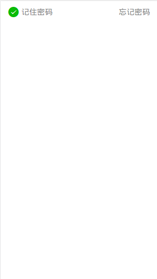
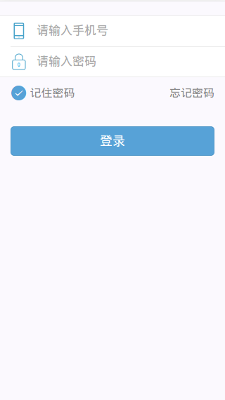

# 代码示例
```
<div class="login-help">
<div class="login-help-left">
  <label for="checkbox">
      <div class="weui_cells_checkbox">
        <input type="checkbox" class="weui_check" name="check" checked="checked" id="checkbox">
        <i class="weui_icon_checked"></i>
        <span>记住密码</span>
      </div>
  </label>
</div>
<a href="#" class="login-help-right">忘记密码</a>
</div>
```
# 示意图


